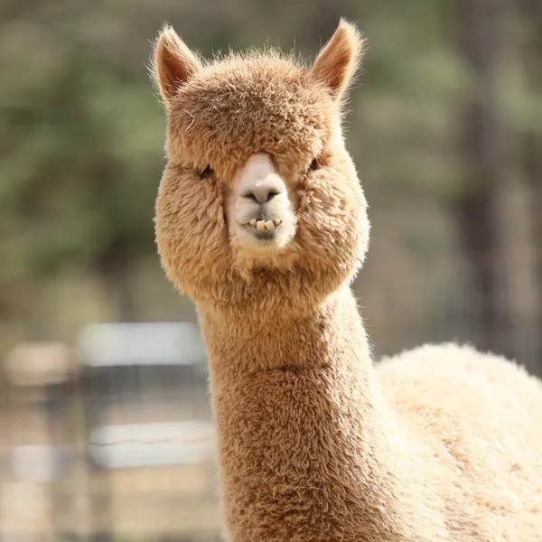

# Alpacas

This is what an alpaca looks like:



This is an ordered list of alpaca facts ranked by importance:

1. Cute
2. Soft
3. Good guard animals
4. Make nice wool

This is an unordered list of alpaca facts:
- Alpacas have fluffy, crimped wool that gives them a teddy bear-like appearance.
- They are slender-bodied with long legs and necks, small heads, and large, pointed ears.
- Alpacas are domesticated members of the camel family.
- They have a soft fleece that is virtually free of guard hair and comes in a variety of colors.
- Alpacas have soft, padded feet that leave delicate grasses and terrain undamaged while grazing.

This is a [link](https://example.com)

Relative [link](one/two/update_me.rb)

This is a todo list:
- [ ] Feed alpacas
- [X] Pet alpacas
- [ ] Shear alpacas


## This is a smaller heading for the next section

Alpacas are domesticated animals native to South America. Alpacas are known for their soft and luxurious 
fleece. There are two breeds of alpacas: Huacaya and Suri. Alpacas are social herd animals that live in 
family groups. Alpacas communicate with a series of vocalizations."


Here is some example code:

```ruby
class Alpaca
  attr_accessor :name, :color, :age, :gender

  CUTE_NAMES = ["Fluffy", "Cuddles", "Snuggles", "Bubbles", "Puffy", "Daisy", "Buttercup", "Honey", "Muffin", "Peaches"]

  def initialize(color, age, gender)
    @color = color
    @age = age
    @gender = gender
    @name = generate_name
  end

  def generate_name
    CUTE_NAMES.sample
  end
end

# Example usage
alpaca = Alpaca.new("white", 2, "female")
puts alpaca.name  # This will print a random cute name from the list
```

`@alpaca_pun = "alpaca my bags"`

> I love alpacas
>
> — Abraham Lincoln

<table>
  <tr>
    <th>ID</th><th>Name</th><th>Rank</th>
  </tr>
  <tr>
    <td>1</td><td>Fluffy</td><td>#1</td>
  </tr>
  <tr>
    <td>2</td><td>Cuddles</td><td>Also #1</td>
  </tr>
</table>

This is another set of facts that will be useful!
- Alpacas are great
- They are playful
- They are fun
